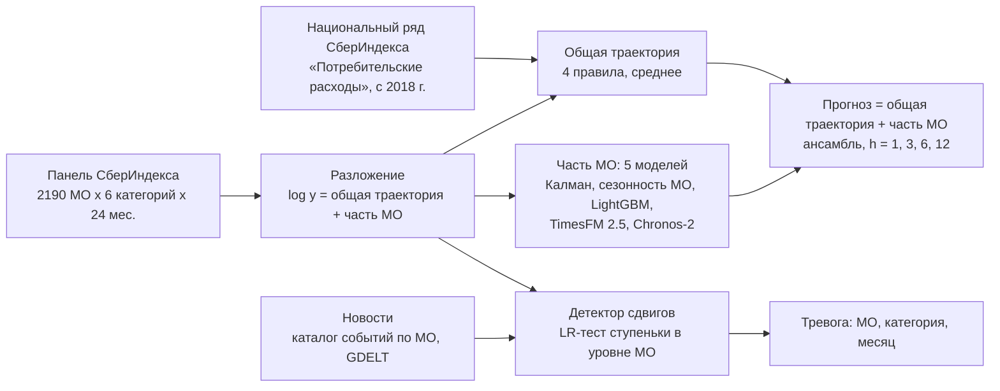

# Прогноз потребительских расходов МО и ранняя детекция структурных сдвигов

Методологический отчёт. Конкурс СберИндекса 2026, номинация «Прогнозирование».

## 1. Коротко

- **Задача.** Прогноз расходов жителей МО (руб. на жителя в месяц, 6 категорий, 2190 МО) на 1, 3, 6 и 12 месяцев и раннее обнаружение структурных сдвигов.
- **Главная находка.** Ряды МО двигаются в основном вместе со страной. Если подставить в прогноз истинную будущую общую траекторию категории, MAE падает вдвое. Значит, главное - хорошо прогнозировать общую траекторию. За 24 месяца панели годовую сезонность не оценить, поэтому берём её из длинного национального ряда СберИндекса «Потребительские расходы» (с декабря 2018 г.).
- **Модель.** `log y_it = n_ct + mu_it + r_it`: общая компонента категории + уровень МО (случайное блуждание, сдвиги) + временное отклонение (AR(1)). Параметры оцениваются ММП по всей панели фильтром Калмана.
- **Детекция.** Сдвиг = ступенька в уровне `mu`. Лучший детектор выбран при равной доле ложных тревог по полноте и задержке на вставленных сдвигах.
- **Новости.** Каталог 37 проверенных событий по 51 МО (паводки 2024 г., тайфун 2023 г. и др.) и поток новостей GDELT по 811 МО; используется только то, что известно на момент прогноза. Проверенные события почти вдвое повышают полноту детекции на реальных сдвигах; сырой поток новостей не предупреждает о сдвигах заранее и ничего не добавляет.

| MAE, руб. на жителя | h = 1 | h = 3 | h = 6 | h = 12 |
|---|---|---|---|---|
| **Ансамбль** (5 моделей на одном разложении) | **313** | **461** | **548** | **607** |
| TimesFM 2.5 на локальной компоненте (лучшая одиночная) | 310 | 460 | 549 | 632 |
| Prophet (базовая модель конкурса) | 606 | 642 | 764 | 922 |
| Наивная (последнее значение) | 678 | 843 | 1 057 | 1 403 |

Ансамбль точнее Prophet на 48 / 28 / 28 / 34 %. R² ансамбля 0.994-0.997 на всех горизонтах (Prophet 0.982-0.989).
Фундаментальная модель TimesFM 2.5 без дообучения почти догоняет ансамбль, но только внутри разложения:
на сырых рядах фундаментальные модели проигрывают даже наивной на h = 12. Лучший детектор - LR-тест ступеньки в уровне
внутри той же модели, с новостями, в двух каналах (сам ряд и ряд относительно соседей по дорогам): при 5 % ложных
тревог находит 47 % вставленных сдвигов (BOCPD - 34 %, CUSUM - 11 %), в среднем в тот же месяц; на реальных данных
при 1 % месяцев с тревогой 84-85 % тревог каждого канала попадают на подтверждённые сдвиги.

### Как это работает, без формул

Расходы жителей любого МО складываются из двух частей. Первая - то, что происходит со всей страной:
декабрьский пик, рост цен и доходов, бум маркетплейсов. Она общая для всех МО и видна в длинном
национальном ряду СберИндекса, который начинается в 2018 г. Вторая - особенности самого МО: его
уровень (богатый город или бедный район), его собственная сезонность (курорт, студенческий город) и
редкие сдвиги (закрылся крупный магазин, прошёл паводок). Мы прогнозируем эти части отдельно и
складываем. Так 24 месяцев данных хватает: сезонность и рост берём у страны, а по МО оцениваем только
то, что у него своё. Сдвиг - это момент, когда уровень МО резко и надолго меняется; детектор сравнивает,
насколько новые данные лучше объясняются «ступенькой», чем обычным шумом этого МО.



### Где в отчёте ответ на каждый критерий

| Критерий конкурса | Вес | Где |
|---|---|---|
| Простое объяснение методологии | 10 % | этот раздел, разделы 2 и 5 |
| Сравнение моделей на 4 горизонтах, выбор лучшей, сравнение с Prophet | 20 % | раздел 6 (16 моделей, тест Диболда-Мариано, по категориям) |
| Сравнение методов детекции, выбор лучшего | 20 % | раздел 7 (4 детектора и их варианты относительно соседей, синтетика при равных ложных тревогах с 5 повторами, реальные данные и события) |
| Фундаментальные модели (Chronos, TimesFM) | 15 % | раздел 9 (Chronos-2, TimesFM 2.5, TiRex; без дообучения и с дообучением; 8 вариантов встраивания) |
| Новости, согласование с данными СберИндекса | 15 % | раздел 8 (каталог 37 событий, поток GDELT, проверка опережения), раздел 5 (национальный ряд СберИндекса) |
| MAE | 10 % | разделы 1 и 6 (MAE в рублях на всех горизонтах и по категориям) |
| Интерпретация, ясность, воспроизводимость | 10 % | разделы 10, 11; README; `python -m sbi.run_all`; тесты без утечки будущего |

## 2. Данные и что в них видно

| Категория | доля дисперсии лога: уровень МО | общая (месяц) | остаток |
|---|---|---|---|
| Все категории | 0.889 | 0.095 | 0.015 |
| Продовольствие | 0.851 | 0.126 | 0.022 |
| Маркетплейсы | 0.519 | 0.430 | 0.052 |
| Общественное питание | 0.947 | 0.021 | 0.033 |
| Здоровье | 0.900 | 0.044 | 0.056 |
| Транспорт | 0.926 | 0.028 | 0.047 |

Разложение `log y_it = a_i + n_ct + e_it` (двусторонние эффекты по каждой категории).
Уровень МО почти постоянен, вся динамика - общая траектория категории плюс небольшой локальный шум.
Для прогноза это значит: (1) модель надо строить на всей панели, а не по отдельным рядам;
(2) ошибка на горизонтах определяется прогнозом общей траектории.

Ограничения данных, важные для выводов:
- 24 месяца (2023-01 - 2024-12): горизонт 12 проверяется ровно одним способом - обучение на 2023, прогноз на 2024;
- одного года мало, чтобы отделить годовую сезонность от тренда (декабрьский пик ~ +20 %);
- в выборке нет Курской и Белгородской областей (оценки не прошли порог качества СберИндекса), поэтому события
  августа 2024 г. проверить нельзя; проверяемы паводки апреля 2024 г. (Оренбургская, Курганская, Тюменская области),
  тайфун в Приморье (август 2023 г.) и др.

## 3. Схема проверки

- **Скользящее начало прогноза.** Точка начала o = последний известный месяц, от 2023-12 до 2024-11 (12 точек).
  В каждой модель видит только данные до o и прогнозирует на 1-12 месяцев вперёд.
  Для h = 1 это 12 точек проверки, h = 3 - 10, h = 6 - 7, h = 12 - одна (2023-12 -> 2024-12).
- **Метрики.** MAE в рублях на жителя (главная), R² и WAPE на всех парах (МО, категория, месяц), а также по категориям.
  Прогноз строится в логах и возводится в экспоненту - это условная медиана, которая и минимизирует MAE.
- **Значимость.** Тест Диболда-Мариано для разности абсолютных ошибок против Prophet: разности усредняются по МО
  внутри точки начала, затем t-статистика с HAC-дисперсией по точкам начала (лаг h-1). Для h = 12 точка одна,
  поэтому дисперсия по МО (кластеры - МО, ошибки по категориям суммируются).
- **Без заглядывания вперёд.** Общая компонента, параметры моделей, выбор национального ряда, новости - всё по данным
  до точки начала. Исключение, о котором надо сказать: национальный ряд взят в текущей редакции сайта (октябрь 2026 г.),
  возможные пересмотры прошлых значений не учтены.

## 4. Модели прогноза

| Модель | Что это |
|---|---|
| `prophet` | базовая модель конкурса: Prophet на каждом ряду отдельно, настройки по умолчанию (годовая сезонность выключается автоматически при < 2 лет данных) |
| `prophet_seasonal` | вторая, более сильная база: Prophet на ряде, очищенном от сезонных факторов национального ряда категории (по данным до точки начала), сезонность возвращается в прогноз |
| `naive` | последнее значение |
| `seasonal_naive` | значение того же месяца год назад |
| `panel_ssm` | **центральная модель** (раздел 5) |
| `panel_ssm_news` | то же + новости (раздел 8) |
| `panel_seasonal` | то же разложение, локальное отклонение МО затухает от текущего к прошлогоднему в тот же месяц: `z(T+h) = 0.6^h z(T) + (1 - 0.6^h) z(T+h-12)` - собственная сезонность МО (курорты, вахтовые посёлки, студенческие города), которой нет в национальной |
| `lgbm` | LightGBM на всей панели: признаки - лаги локального отклонения, категория, горизонт, месяц, уровень МО, индекс доступности рынков, изменения у 10 ближайших соседей по автодорогам (connection.parquet); цель - изменение сверх прогноза общей компоненты |
| `lgbm_news` | то же + неожиданность новостей GDELT о МО (или его регионе) в месяцы o и o-1 (раздел 8) |
| `timesfm_local` | TimesFM 2.5 (google/timesfm-2.5-200m) без дообучения прогнозирует локальную компоненту `log y - n`; общая траектория - из правил раздела 5 |
| `chronos2_local` | то же с Chronos-2 |
| `chronos2_ft_local` | то же, Chronos-2 дообучен (LoRA) на локальных компонентах панели отдельно для каждой точки начала, только по данным до неё (раздел 9) |
| `tirex_local` | то же с TiRex (NX-AI, xLSTM); на CPU медленный, посчитан на подвыборке 2 995 рядов (раздел 9) |
| `ensemble` | **итоговая модель**: среднее в логах пяти моделей на разложении (`panel_ssm`, `panel_seasonal`, `lgbm`, `timesfm_local`, `chronos2_local`), веса равные, состав задан правилом «все модели на разложении», а не отбором по тесту |
| `chronos2`, `timesfm` | фундаментальные модели без дообучения на сырых рядах, каждый ряд отдельно |
| `chronos2_cross` | Chronos-2 с cross-learning: ряды одной категории в одном батче видят друг друга |
| `panel_ssm_chronos` | центральная модель, но национальный ряд прогнозирует Chronos-2 вместо правил |

## 5. Центральная модель

**Разложение.** Для категории c: `log y_it = n_ct + z_it`. Общая компонента `n_ct` - временной эффект в
двусторонней модели `log y_it = a_i + n_ct` (чередующиеся средние на несбалансированной панели).

**Локальная часть - модель пространства состояний:**

```
z_it  = mu_it + r_it
mu_it = mu_i,t-1 + eta_it,     eta ~ N(0, lam * s * k_i)     постоянный уровень МО (сдвиги)
r_it  = phi * r_i,t-1 + u_it,  u   ~ N(0, s * k_i)           временные отклонения
```

`k_i` - масштаб шума ряда (робастная дисперсия первых разностей): мелкие МО шумнее крупных.
Параметры `(lam, phi)` общие для категории и оцениваются ММП: фильтр Калмана векторизован по всем МО,
общий масштаб `s` концентрирован из правдоподобия, начальный уровень диффузный. Точечный прогноз
`z_hat(T+h) = mu_T + phi^h r_T` зависит только от `(lam, phi)`.

Оценки ММП по точке начала 2024-11 (23 месяца данных):

| Категория | lam (шок уровня / шок AR) | phi |
|---|---|---|
| Все категории | 2.04 | 0.04 |
| Продовольствие | 1.15 | 0.11 |
| Маркетплейсы | 1.02 | 0.18 |
| Общественное питание | 0.30 | 0.74 |
| Здоровье | 0.37 | 0.46 |
| Транспорт | 2.62 | 0.48 |

Главное в оценках: дисперсия шока **уровня** сравнима с дисперсией временного шока или больше её. Отклонения МО
от страны в основном постоянны, а не затухают: прогноз локальной части близок к последнему отфильтрованному уровню.
Простое разложение с постоянным средним МО (раздел 2) показывало AR(1) остатка 0.5-0.7, но это артефакт:
среднее за 24 месяца искусственно делает отклонения возвратными. Временная часть заметна только у общепита и
здоровья (phi 0.5-0.7). На коротких историях оценки неустойчивы (в 2023-12 у транспорта lam упирается в 500,
т. е. почти чистое случайное блуждание), поэтому параметры переоцениваются в каждой точке начала.

**Общая компонента** (`sbi/national.py`). Национальный ряд x_t (лог млрд руб. в месяц, 2018-12 - точка начала)
сопоставлен категории по смыслу: «Все категории» и «Здоровье» - сумма, «Продовольствие» - продовольственные
товары, «Маркетплейсы» - непродовольственные, «Общепит» - общественное питание, «Транспорт» - услуги.
Четыре простых правила и их среднее:

| Правило | Прогноз `n_hat(T+h)` |
|---|---|
| `snaive` | `n(T+h-12) + G` - тот же месяц год назад плюс годовой рост |
| `hybrid` | `n(T) + сезонная разность + G*h/12`; разность из панели за прошлый год, очищенная от прошлогоднего роста, если год назад есть, иначе из сезонных факторов национального ряда |
| `airline` | `n(T) + x_hat(T+h) - x(T)`, где x_hat - SARIMA(0,1,1)(0,1,1)12 по национальному ряду с 2021 г. |
| `extlvl` | уровень без сезонности (3 мес.) + `G*h/12` + сезонный фактор национального ряда (2x12 MA, медиана по годам без 2020) |
| `combo` | **среднее четырёх** - используется в модели |

`G` - годовой рост: по национальному ряду за последние 12 месяцев; когда в панели уже есть год назад - среднее с ростом панели.

Две проверки, которые стоит знать:
- **Ошибка двойного учёта роста (найдена и исправлена).** Первая версия `hybrid` брала прошлогоднюю сезонную разность
  вместе с прошлогодним ростом и добавляла сверху `G*h/12`. Исправление снизило MAE правила на h = 6 с 977 до 548 руб.
  и MAE центральной модели на h = 6 с 659 до 588 руб.
- **Сжатие роста к долгосрочному среднему не помогло.** На истории самого национального ряда (прогноз роста 2022 и
  2023 гг.) среднее «рост за последний год / средний рост с 2019 г.» точнее каждого из них (ошибка 0.054 против 0.059
  и 0.074), но на панели оно ухудшило h = 1-6. Оставлен рост за последний год (`growth: last`).

Главная оставшаяся ошибка - рост 2024 г. В декабре 2023 г. национальный ряд показывал рост +16-17 % (бум 2023 г.),
а в 2024 г. общая траектория выросла меньше (все категории +13.6 %, здоровье +9 %, транспорт +7 %), маркетплейсы же
выросли на 48 % против прогнозных +22 %. Если бы общая траектория 2024 г. была известна точно («оракул», `python -m sbi.ablation`), MAE на h = 12 упал бы с 702 до 626 руб.

### Что ещё проверили и отвергли: регион и модель роста (`python -m sbi.studies`)

**Региональная компонента.** Между страной и МО есть уровень региона: справочник «МО - регион» восстановлен
по сопоставлению мест GDELT и блокам кодов МО (78 регионов). «Регион x месяц» объясняет 18-33 % дисперсии
локального остатка МО (больше всего у «Всех категорий» - 33 %). Но для прогноза это почти бесполезно: даже если
будущее изменение средней по региону локальной компоненты известно точно, MAE падает лишь с 333 / 493 / 583 / 652
до 319 / 469 / 566 / 662 руб. (h = 1 / 3 / 6 / 12), то есть на 2-5 % при h <= 6 и не падает при h = 12. Причина -
отклонения МО устойчивы (раздел 5): модель уровня МО уже несёт региональную динамику в себе. Региональный
сезонный профиль вместо профиля самого МО тоже хуже. Региональную модель в прогноз не включали.

**Модель роста общей траектории.** Гипотеза: рост 2024 г. мы переоценили, потому что не учли жёсткую
денежно-кредитную политику (ключевая ставка 16 % в декабре 2023 г.). Проверили на длинном ряде розничного
оборота (с 2000 г. до 2018-11 - Росстат по описанию источника, далее совпадает с национальным рядом СберИндекса; ряд и реальная ключевая ставка
СберИндекса - в `ref/`) в псевдо-реальном времени: на каждом декабре 2016-2022 гг. модель оценивается только по
годам, рост которых уже известен, и прогнозирует рост следующего года (7 лет x 3 ряда).

| Правило годового роста | Средняя абсолютная ошибка роста (логи) |
|---|---|
| средний рост за 5 лет | **0.044** |
| AR(1) годового роста | 0.049 |
| AR(1) + реальная ставка + изменение ставки за 6 мес. | 0.054 |
| AR(1) + реальная ставка | 0.057 |
| рост за последний год (используется в модели) | 0.058 |

Ставка в регрессии не помогает: за 2013-2022 гг. эпизодов жёсткой политики мало (2014-2015, 2022), коэффициенты
неустойчивы. «Средний рост за 5 лет» лучше на истории, но на панели проигрывает: на h = 12 MAE 790 против 654 руб.
(простая локальная часть). Причина видна по категориям: в 2024 г. маркетплейсы выросли на 48 %, а все
национальные ряды (на которые опирается любое правило роста) - на 9-17 %; длинное среднее занижает рост ещё
сильнее, чем рост за последний год. Собственный рост панели внутри 2023 г. верно указывает на маркетплейсы (+57 %),
но для остальных категорий хуже национального ряда. Итог: по информации на декабрь 2023 г. ни одна из проверенных
моделей роста не уменьшает ошибку h = 12 надёжно, а подбирать правило по единственной точке h = 12 значило бы
подгонку под тест. Оставлен рост за последний год.
Правила не подбирались под тест: усреднение выбрано заранее как стандартный устойчивый приём
(комбинация прогнозов почти никогда не хуже худшего правила и обычно близка к лучшему).

## 6. Результаты прогноза

**MAE, руб. на жителя в месяц** (все МО, категории и точки начала; чем меньше, тем лучше):

| Модель | h = 1 | h = 3 | h = 6 | h = 12 |
|---|---|---|---|---|
| **`ensemble`** (5 моделей на разложении) | 313 | 461 | **548** | **607** |
| `timesfm_local` | **310** | **460** | 549 | 632 |
| `chronos2_local` | 321 | 479 | 582 | 697 |
| `chronos2_ft_local` (дообучен) | 320 | 466 | 559 | 662 |
| `panel_ssm` (центральная) | 329 | 493 | 588 | 700 |
| `panel_ssm_news` | 329 | 493 | 587 | 700 |
| `lgbm` | 329 | 489 | 596 | 705 |
| `lgbm_news` | 330 | 486 | 592 | 702 |
| `panel_seasonal` | 333 | 507 | 593 | 651 |
| `panel_ssm_automap` (абляция, старое правило `hybrid`) | 320 | 507 | 680 | 738 |
| **`prophet` (базовая)** | 606 | 642 | 764 | 922 |
| `panel_ssm_chronos` (старое правило `hybrid`) | 447 | 718 | 881 | 1 332 |
| `naive` | 678 | 843 | 1 057 | 1 403 |
| `seasonal_naive` | 1 257 | 1 322 | 1 308 | 1 403 |
| `timesfm` | 626 | 843 | 1 202 | 2 614 |
| `chronos2_cross` | 630 | 867 | 1 237 | 2 632 |
| `chronos2` | 656 | 893 | 1 283 | 2 688 |

**R²:** ансамбль 0.997 / 0.995 / 0.994 / 0.995, Prophet 0.989 / 0.989 / 0.984 / 0.982.
**WAPE:** ансамбль 3.6 / 5.2 / 6.0 / 5.8 %, Prophet 7.0 / 7.2 / 8.4 / 8.8 %.
Полные таблицы, в том числе по категориям, - `out/tables.md` (строятся `python -m sbi.report`).

**Выбор лучшей модели - ансамбль**: среднее прогнозов в логах пяти моделей, построенных на одном разложении
(`panel_ssm`, `panel_seasonal`, `lgbm`, `timesfm_local`, `chronos2_local`), веса равные. Состав задан правилом
«все модели на разложении», а не отбором лучших по тесту. Модели устроены по-разному (явная модель пространства
состояний, сезонный профиль МО, бустинг с соседями по графу дорог, две фундаментальные модели), и их ошибки частично
гасят друг друга: на h = 12 лучшая одиночная модель даёт 632 руб., ансамбль - 607. На h = 1-3 TimesFM на локальной
компоненте в одиночку не хуже ансамбля (разница 1-3 руб.), так что упрощённый вариант решения - одна эта модель.

**Против Prophet (тест Диболда-Мариано, разность средних абсолютных ошибок ансамбля и Prophet):**

| h | разность, руб. | DM | p | единиц |
|---|---|---|---|---|
| 1 | -294 | -3.42 | 0.006 | 12 точек начала |
| 3 | -181 | -2.05 | 0.071 | 10 точек начала |
| 6 | -217 | -6.64 | < 0.001 | 7 точек начала |
| 12 | -315 | -20.8 | < 0.001 | 2 076 МО (одна точка начала) |

Ансамбль точнее Prophet на 48 / 28 / 28 / 34 %. На h = 3 преимущество значимо только на уровне 10 %: ансамбль лучше
в 8 точках начала из 10, в 2023-12 ничья (474 против 473), в 2024-01 лучше Prophet (616 против 454). Значимость
съедает большой разброс разностей: из точки 2024-09 Prophet промахивается по декабрьскому пику (1 311 руб. против
446 у ансамбля). Для h = 12 p-значение занижено (см. раздел 10): все МО получают общий шок 2024 г.

**По категориям** ансамбль лучше Prophet везде, кроме одного случая и одной ничьей:
- «Маркетплейсы», h = 12: 1 008 против 757 руб. Категория выросла за год на 61 %, а национальный ряд,
  сопоставленный ей по смыслу (непродовольственные товары), за тот же год вырос на 17 %. Prophet с линейным трендом
  по самому ряду ловит этот рост лучше. Нужна своя национальная серия по маркетплейсам, которой в открытых данных
  СберИндекса нет.
- «Продовольствие», h = 6: 986 против 973 руб. (ничья).

Самый большой выигрыш - «Все категории» (крупные суммы): 898 против 1 827 руб. на h = 1 и 1 331 против 3 067 на h = 12.

## 7. Детекция структурных сдвигов

**Что ищем.** Структурный сдвиг - устойчивое изменение уровня расходов МО сверх общей траектории категории
(ступенька в `mu`). Временный выброс сдвигом не считается.

**Детекторы** (`sbi/detect.py`). Все работают онлайн: оценка в месяц t считается только по данным до t.
Вход - лог ряда минус общая компонента категории, в единицах шума ряда.

| Детектор | Идея |
|---|---|
| CUSUM | кумулятивная сумма Пейджа по остаткам AR(1) относительно опорного уровня (карта для автокоррелированных данных) |
| PELT | точное разбиение на сегменты (ruptures, l2); оценка - наибольший штраф, при котором есть точка разладки в последних 3 мес. |
| BOCPD | байесовская онлайн-детекция (Adams, MacKay 2007); оценка - логит P(длина текущего сегмента < 3) |
| `ssm_lr` | LR-тест ступеньки в уровне внутри модели раздела 5: дополненный фильтр Калмана (de Jong 1991), максимум по моменту ступеньки в последних 3 мес.; при H0 ~ chi²(1) |
| `*_spatial` | тот же детектор на ряде «МО минус среднее 10 ближайших соседей по дорогам в той же категории» (connection.parquet; значения соседей за тот же месяц): общие для местности колебания вычитаются |

**Протокол сравнения** (`sbi/detect_eval.py`). 1800 полных рядов (по 300 на категорию). У 30 % рядов
в случайный месяц от 2023-09 до 2024-09 вставлена ступенька ±10, 20 или 30 % (соседи не сдвигаются).
Опорный период - первые 8 месяцев. Порог каждого детектора подобран на рядах без вставки так, чтобы ложная тревога
была у одинаковой доли рядов (0.5-20 %). При равных ложных тревогах сравниваем полноту (сдвиг найден в месяц
ступеньки или за 2 следующих), точность и задержку - это честнее, чем сравнивать при «настройках по умолчанию»:
у детекторов разные шкалы. **5 повторов** с разными случайными вставками дают 95 % интервалы. Сводная мера по всей
кривой - площадь под кривой «полнота - доля ложных тревог» на участке 0-20 %, делённая на 0.2.

**Результаты (5 повторов, среднее ± 95 % интервал):**

| Детектор | Полнота при 5 % ложных | Площадь под кривой | Точность | Задержка, мес. | Полнота при сдвиге 10 / 20 / 30 % |
|---|---|---|---|---|---|
| CUSUM | 0.107 ± 0.012 | 0.18 | 0.47 | 1.22 | 0.02 / 0.10 / 0.21 |
| `ssm_lr` | 0.319 ± 0.031 | 0.37 | 0.68 | **0.03** | 0.12 / 0.34 / 0.51 |
| PELT | 0.337 ± 0.020 | 0.37 | 0.73 | 0.68 | 0.13 / 0.37 / 0.53 |
| BOCPD | 0.341 ± 0.019 | 0.40 | 0.69 | 0.11 | 0.14 / 0.37 / 0.53 |
| `ssm_lr_spatial` | 0.389 ± 0.029 | 0.43 | 0.73 | 0.05 | 0.19 / 0.42 / 0.56 |
| BOCPD + новости | 0.374 ± 0.017 | 0.50 | 0.71 | 0.10 | 0.17 / 0.40 / 0.57 |
| `ssm_lr` + новости | 0.399 ± 0.023 | 0.51 | 0.73 | 0.04 | 0.18 / 0.43 / 0.60 |
| BOCPD `_spatial` | 0.414 ± 0.028 | 0.46 | 0.75 | 0.09 | 0.22 / 0.45 / 0.58 |
| **`ssm_lr_spatial` + новости** | **0.466 ± 0.048** | **0.56** | **0.76** | 0.05 | **0.27 / 0.49 / 0.65** |

Новости в синтетике есть у половины настоящих сдвигов и у 2 % рядов без них. Полная сетка (все уровни ложных
тревог, по категориям, по повторам) - `out/detection_synthetic.csv`, сводка - `out/detection_summary.csv`.

Выводы:
- **CUSUM не подходит**: уровни рядов МО блуждают (в модели раздела 5 дисперсия шока уровня сравнима с шумом),
  а CUSUM предполагает стабильный процесс «в норме». Чтобы не тревожить на 95 % чистых рядов, порог приходится
  поднимать так высоко, что настоящие сдвиги теряются.
- **BOCPD, PELT и `ssm_lr` по полноте статистически неразличимы** (0.32-0.34, интервалы перекрываются), но `ssm_lr`
  реагирует быстрее всех: в среднем через 0.03 месяца, PELT - через 0.7, ему нужно несколько точек после ступеньки.
- **Вычитание соседей помогает каждому детектору**: шум ряда падает с 0.041 до 0.036 (медиана sd в логах), полнота
  растёт на 7 п. п., на мелких сдвигах (10 %) - в 1.6 раза.
- **Выбор - `ssm_lr` с новостями, в двух каналах**: обычный ряд и ряд относительно соседей. Тревога приходит в тот же
  месяц, детектор - часть той же модели, что делает прогноз (одни параметры, одно правдоподобие), а два канала
  отличают общий для местности шок от собственного шока МО (см. реальные данные ниже).
- Сдвиги около 10 % в шумных рядах ловятся плохо: шум общепита в мелких МО достигает 18 % в месяц. Полнота лучшего
  варианта по категориям: «Продовольствие» 0.83, «Все категории» 0.79, «Транспорт» 0.35, «Маркетплейсы» 0.34,
  «Здоровье» 0.30, «Общепит» 0.22.

**Реальные данные, все ряды** (`sbi/detect_real.py`, `labeled_study`). У реальных рядов нет разметки сдвигов,
поэтому размечаем задним числом: сдвиг в месяц t подтверждён, если среднее за t..t+2 отличается от среднего
за t-3..t-1 больше чем на 6 единиц шума ряда. Детектор работает онлайн и этой разметки не видит. Разметок две:
сдвиг самого ряда и сдвиг ряда «МО минус среднее его 10 ближайших соседей по дорогам».

| Метки | Детектор | Точность / полнота при 1 % месяцев с тревогой | при 2 % | при 5 % |
|---|---|---|---|---|
| сдвиг самого ряда | **`ssm_lr`** | **0.85 / 0.34** | 0.74 / 0.52 | 0.54 / 0.80 |
| | `ssm_lr_spatial` | 0.23 / 0.08 | 0.19 / 0.13 | 0.14 / 0.23 |
| | `ssm_lr_combo` | 0.58 / 0.24 | 0.50 / 0.38 | 0.40 / 0.65 |
| сдвиг относительно соседей | `ssm_lr` | 0.24 / 0.11 | 0.18 / 0.16 | 0.13 / 0.26 |
| | **`ssm_lr_spatial`** | **0.84 / 0.44** | 0.72 / 0.66 | 0.47 / 0.89 |
| | `ssm_lr_combo` | 0.58 / 0.32 | 0.51 / 0.50 | 0.38 / 0.78 |

Обычный и пространственный детекторы решают **разные задачи**, и каждый точен на своей: 84-85 % тревог при 1 %
месяцев с тревогой. Это делает тревогу интерпретируемой: сработал только `ssm_lr` - сдвиг общий для местности
(паводок по всему бассейну, региональная мера); сработал `ssm_lr_spatial` - у МО что-то своё (закрылся или открылся
крупный объект, пункты выдачи маркетплейса). Объединение «любой из двух» - компромисс, хуже каждого на своей задаче;
поэтому в мониторинге оставляем два канала, а не один общий.

**Реальные события** (`sbi/detect_real.py`). Объединённый каталог (раздел 8): 36 событий после опорного периода,
49 МО, 294 ряда. Порог - 5 % ложных тревог на случайной выборке из 1500 рядов.

| Детектор | Доля рядов событий с тревогой за 3 мес. | Среди 38 рядов со сдвигом больше 10 % |
|---|---|---|
| CUSUM | 1.0 % | 2.6 % |
| PELT | 3.4 % | 23.7 % |
| BOCPD | 3.1 % | 13.2 % |
| BOCPD + новости | 3.4 % | 13.2 % |
| `ssm_lr` | 3.7 % | 15.8 % |
| **`ssm_lr` + новости** | **8.2 %** | **28.9 %** |
| `ssm_lr_spatial` | 2.7 % | 7.9 % |
| `ssm_lr_combo` + новости | 4.4 % | 18.4 % |

Пространственный детектор на событиях каталога слабее, и это ожидаемо: паводок затапливает и соседей, сдвиг
относительно них мал. Для региональных ЧС нужен обычный канал.

Главное, что показали реальные события: **в месячных безналичных расходах на жителя большинство ЧС 2023-2024 гг.
не дало заметного устойчивого сдвига**. Сдвиг ряда относительно своей категории (3 мес. после против 3 мес. до)
больше 10 % только у 13 % рядов событий, больше 5 % - у 35 %. Исключения: Звериноголовский МО (паводок на Тоболе): здоровье -36 %, маркетплейсы -31 %,
всё вместе -10 %; там `ssm_lr` + новости даёт тревогу на 0-2-й месяц. Орск: маркетплейсы и общий уровень - тревога
через месяц после прорыва дамбы, причём уровень вырос, а не упал (вероятное объяснение - выплаты пострадавшим
и восстановление имущества; проверить по данным мы это не можем). Так что новости - не «сигнал сдвига»,
а повышение априорной вероятности: если данные сдвига не показывают, тревоги нет.

## 8. Новости

Новости в работе - два источника разной природы, и проверены они по-разному.

**1. Каталог проверенных событий** (`ref/events_merged.csv`, собирается `python -m sbi.news`): наш каталог
(6 событий, 20 МО) объединён с проверенными событиями реестра участника maloyan (лицензия MIT, у каждого события
ссылка на первоисточник). Итого 37 событий, 51 МО: паводки апреля-мая 2024 г. в Оренбургской, Курганской,
Тюменской и Омской областях, наводнение в Приморье после тайфуна Ханун (август 2023 г.), лесные пожары, теракт
в «Крокус Сити Холле», авария теплоснабжения в Климовске. Курской и Белгородской областей в данных нет.

**2. Поток новостей GDELT** (`ref/news/`, агрегаты того же участника, MIT): помесячное число сообщений о каждом
МО из мировой базы новостей GDELT - всего, негативных и о бедствиях (катастрофы, паводки, пожары). Покрыто 811 МО;
для остальных берём поток их региона (справочник «МО - регион» восстановлен по сопоставлению мест GDELT и блокам
кодов МО, 78 регионов). Привязку мест к МО мы проверили на выборке: все 29 мест из панели привязаны верно.
Из потока считаем **неожиданность новостей**: насколько число сообщений в месяце выше среднего за 6 прошлых месяцев
(в логах). Она считается только по прошлому.

**Согласование с данными без утечки.** У события две даты: месяц, когда оно влияет на ряд (`event_month`, формат
панели), и дата, когда о нём стало известно (`announce_date`). В точке начала o используются только события с
`announce_date` не позже конца месяца o, и только новости GDELT за месяцы до o включительно. Ключи - те же
`territory_id` и месяц, что в панели СберИндекса. Это проверяют тесты (`tests/test_no_leakage.py`): порча событий
и новостей после точки начала не меняет ни прогноз, ни детектор.

**Как новость входит в модели.** Новость - не сигнал «сдвиг произошёл», а повышение априорной вероятности сдвига:
- в детекторе `ssm_lr` - к статистике LR добавляются лог-шансы `2 ln 25` в МО с событием (порог ниже);
- в BOCPD - вероятность разладки x25;
- в прогнозе `panel_ssm_news` - дисперсия шока уровня в месяц события x25 (фильтр быстрее принимает новый уровень);
- в `lgbm_news` - неожиданность новостей GDELT о МО в месяцы o и o-1 как признаки.

**Предупреждают ли новости заранее?** Задача говорит «заранее выявлять предстоящие шоки». Проверили напрямую:
во сколько раз чаще подтверждённый сдвиг в данных случается рядом с новостным всплеском (сообщений в ~2.7 раза
больше обычного), если новость пришла за 2 или 1 месяц до сдвига, в тот же месяц или позже. Ожидаемая частота
сдвигов берётся по месяцам, иначе совпадение по календарю выдаётся за связь (без этой поправки подъём доходил до
1.47 - это был календарный артефакт). Доверительные интервалы - бутстреп по МО (по регионам для регионального потока).

| Новость относительно сдвига | за 2 мес. | за 1 мес. | тот же месяц | через 1 мес. |
|---|---|---|---|---|
| сообщения о бедствиях в самом МО | 1.17 [1.00; 1.36] | 1.03 [0.88; 1.19] | 1.03 [0.89; 1.20] | 1.04 [0.87; 1.23] |
| все сообщения о самом МО | 1.10 [0.98; 1.21] | 1.07 [0.95; 1.19] | 1.05 [0.93; 1.17] | 0.99 [0.87; 1.12] |
| негативные сообщения о самом МО | 1.02 [0.88; 1.17] | 1.02 [0.89; 1.17] | 1.06 [0.94; 1.24] | 0.99 [0.86; 1.16] |
| региональный поток о бедствиях | 0.99 [0.96; 1.01] | 1.00 [0.95; 1.03] | 1.05 [0.98; 1.10] | 0.90 [0.79; 1.03] |

Подъём (во сколько раз чаще сдвиг рядом с новостью) и 95 % интервал; сдвиг - больше 4 единиц шума. При более
строгих порогах (сдвиг 6 и 8 единиц, всплеск в 7 раз) картина та же: подъём выше 1 только при новости за 2 месяца
(1.04-1.40), и интервал везде задевает 1 или лежит на её границе. И этот сигнал, скорее всего, не предупреждение: новость за 2 месяца
попадает в окно «до сдвига», и временный провал от паводка в этом окне с последующим восстановлением сам по себе
выглядит как «сдвиг». Полная таблица - `out/gdelt_event_study.csv`.

**Что дали новости:**

| Где | Без новостей | С новостями |
|---|---|---|
| Синтетика: полнота при 5 % ложных тревог, 5 повторов (новость есть у половины настоящих сдвигов и у 2 % чистых рядов) | `ssm_lr` 0.32, `ssm_lr_spatial` 0.39, BOCPD 0.34 | `ssm_lr` 0.40, `ssm_lr_spatial` **0.47**, BOCPD 0.37 |
| Реальные события (каталог): ряды с тревогой за 3 мес. / среди рядов со сдвигом > 10 % | `ssm_lr` 3.7 % / 15.8 % | `ssm_lr` **8.2 % / 28.9 %** |
| Все ряды, поток GDELT как поправка к детектору: точность / полнота при 5 % тревог | 0.54 / 0.80 | 0.49 / 0.75 |
| Прогноз на рядах событий, каталог, MAE h = 1 / 3 / 6, руб. (Prophet: 459 / 562 / 671) | `panel_ssm` 319 / 403 / 502 | `panel_ssm_news` 320 / 406 / 508 |
| Прогноз, все ряды, поток GDELT в LightGBM, MAE h = 1 / 3 / 6 / 12, руб. | `lgbm` 329.0 / 488.8 / 596.3 / 705.4 | `lgbm_news` 329.7 / 486.0 / 592.4 / 701.6 |

Выводы:
- **Проверенный каталог событий помогает детекции**: с ним `ssm_lr` ловит почти вдвое больше реальных сдвигов
  при той же доле ложных тревог. Событие сообщает модели, где искать, а решение остаётся за данными.
- **Сырой поток новостей почти ничего не даёт**: нет опережения сверх календаря; как поправка к детектору он на всех
  рядах чуть ухудшает точность; как признак LightGBM снижает MAE меньше чем на 1 % (тест Диболда-Мариано против
  `lgbm`: p = 0.35 / 0.27 / 0.16 на h = 1 / 3 / 6; на h = 12 разница -3.8 руб. формально значима, но это одна
  точка начала). На рядах с новостным всплеском в точке начала выигрыш чуть больше (h = 3: 547 против 555 руб.).
  В ансамбль `lgbm_news` не включали: выигрыш в пределах шума, а менять состав после взгляда на тест - подгонка.
  Число сообщений о МО отражает внимание СМИ (крупные города, политика), а не экономический шок для расходов жителей.
- **В прогнозе новости почти ничего не меняют**: большинство событий не сдвинуло месячные расходы на жителя
  надолго, а где сдвиг был, фильтр перестраивается за 1-2 месяца и без подсказки.
- Практическая схема: новость о ЧС в МО -> детектор с пониженным порогом для этого МО на 2-3 месяца ->
  тревога только если данные это подтверждают.

## 9. Фундаментальные модели временных рядов

Три современные фундаментальные модели, на CPU, точечный прогноз - медиана: **Chronos-2** (`amazon/chronos-2`, 2025 г.:
пропуски, многомерные ряды, ковариаты, cross-learning между рядами батча), **TimesFM 2.5** (`google/timesfm-2.5-200m-pytorch`,
200 млн параметров) и **TiRex** (`NX-AI/TiRex`, xLSTM). Без дообучения и с дообучением; встраивали их в задачу шестью способами:

| Вариант | MAE h = 1 / 3 / 6 / 12, руб. |
|---|---|
| `timesfm` - TimesFM по каждому ряду, контекст = история МО до точки начала | 626 / 843 / 1 202 / 2 614 |
| `chronos2` - Chronos-2 по каждому ряду | 656 / 893 / 1 283 / 2 688 |
| `chronos2_cross` - Chronos-2, ряды одной категории в одном батче (cross-learning) | 630 / 867 / 1 237 / 2 632 |
| `panel_ssm_chronos` - Chronos-2 прогнозирует национальный ряд (с 2018 г.) внутри разложения | 447 / 718 / 881 / 1 332 |
| **`timesfm_local`** - TimesFM прогнозирует локальную компоненту `log y - n` | **310 / 460 / 549 / 632** |
| `chronos2_local` - Chronos-2 прогнозирует локальную компоненту | 321 / 479 / 582 / 697 |
| `chronos2_ft_local` - то же, Chronos-2 **дообучен** (LoRA, 200 шагов) на локальных компонентах панели; своя копия на каждую точку начала, только по данным до неё | 320 / 466 / 559 / 662 |
| для сравнения: `panel_ssm` | 329 / 493 / 588 / 700 |
| для сравнения: Prophet | 606 / 642 / 764 / 922 |

Почему так:
- **На сырых рядах контекст слишком короткий.** В точке 2023-12 у ряда 12 месяцев; декабрьский пик (+20 %) модель
  принимает за тренд и на h = 12 переоценивает весь 2024 г. Никакая модель не извлечёт годовую сезонность из одного года.
- **Cross-learning помогает, но мало** (-4 %): ряды одной категории похожи, но общей траектории в 12-23 точках не хватает.
- **На локальной компоненте фундаментальные модели - лучшие одиночные модели.** Если вычесть общую траекторию
  категории (её сезонность и рост дают правила по национальному ряду), остаётся ряд без декабрьского пика и тренда.
  Его динамику (постепенное затухание отклонений, сезонный профиль МО) TimesFM 2.5 прогнозирует точнее нашей
  модели пространства состояний на всех горизонтах; Chronos-2 - на h = 1-6.
- **Национальный ряд правила прогнозируют лучше.** На 94 месяцах SARIMA и сезонные разности - сильная база,
  а модель без дообучения не знает о COVID-провале 2020 г. и сдвигах 2022 г. в истории ряда.

**TiRex** на CPU в 5-10 раз медленнее остальных (около 5 часов на всю панель), поэтому посчитан на стратифицированной
подвыборке: 500 рядов на категорию, 2 995 рядов. На тех же рядах (`python -m sbi.fm_compare`):

| На подвыборке 2 995 рядов, MAE h = 1 / 3 / 6 / 12, руб. | |
|---|---|
| `timesfm_local` | **312 / 466 / 556** / 650 |
| `tirex_local` | 322 / 477 / 576 / 657 |
| `chronos2_local` | 324 / 485 / 589 / 704 |
| ансамбль | 315 / 468 / 556 / **623** |
| Prophet | 608 / 643 / 765 / 928 |

TiRex - между TimesFM и Chronos-2; TimesFM значимо точнее TiRex на h = 1-6 (тест Диболда-Мариано, p <= 0.002),
на h = 12 разница незначима (p = 0.32).

**Дообучение Chronos-2** (`chronos2_ft_local`). Для каждой точки начала o копия модели дообучается (LoRA, 200 шагов,
окна «контекст - следующие 6 месяцев» внутри известной истории) на локальных компонентах всех ~12 900 рядов только по
данным до o, затем прогнозирует на 12 месяцев; 12 дообучений по ~10 минут на CPU. Против той же модели без дообучения
MAE ниже на 0.5 / 2.7 / 3.9 / 4.9 % (h = 1 / 3 / 6 / 12); на h >= 3 разница значима (тест Диболда-Мариано: p = 0.023,
< 0.001, < 0.001), на h = 1 нет (p = 0.30). Дообученный Chronos-2 догоняет TimesFM 2.5 без дообучения на h = 1-6
(320 / 466 / 559 против 310 / 460 / 549), но не обгоняет. Выигрыш от дообучения растёт с горизонтом: модель учится
на панели, что локальные отклонения МО устойчивы и затухают медленно.

Вывод: фундаментальная модель полезна, когда задача правильно разложена: длинный внешний ряд даёт общую траекторию,
а модель прогнозирует то, что остаётся. TimesFM 2.5 и Chronos-2 на локальной компоненте входят в итоговый ансамбль.
Состав ансамбля задан до того, как мы посчитали TiRex и дообученный Chronos-2, и после этого не менялся: добавлять в
ансамбль модели по результатам на тесте значило бы подгонять его под тест.

## 10. Ограничения и что дальше

- **Короткая история.** h = 12 проверяется одной точкой (2023-12 -> 2024-12). Значимость для h = 12 оценивается
  по разбросу между МО, а не во времени: ошибки всех МО в один год связаны общим шоком, поэтому реальная
  неопределённость выше, чем показывает p-значение.
- **Соответствие категорий национальным рядам.** У «Здоровья» нет своего национального ряда; взята сумма всех
  трат, и на h = 12 модель по этой категории хуже наивной. Выбор ряда по данным (абляция `panel_ssm_automap`)
  исправляет «Здоровье», но портит «Все категории» и «Маркетплейсы»; основным оставлен выбор по смыслу,
  сделанный до оценки.
- **Пересмотры данных.** Национальный ряд взят в текущей редакции сайта; в реальном времени прогнозист видел
  бы предварительные значения.
- **Каталог событий небольшой** (37 событий, 51 МО) и в основном про паводки 2024 г. Поток GDELT покрывает 811 МО,
  но отражает внимание СМИ, а не экономические шоки; для работы в реальном времени нужен поток с отбором
  экономически значимых событий (лента МЧС, указы о режиме ЧС, региональные СМИ с геопривязкой к МО).
- **Новостные данные взяты у другого участника** (агрегаты GDELT и реестр событий, лицензия MIT, с атрибуцией и
  проверкой привязки на выборке). Собственную выгрузку GDELT мы не делали; выводы о потоке новостей зависят от
  качества его тематической разметки.
- **Детекция в шумных рядах.** Сдвиги около 10 % в общепите мелких МО не отличить от шума одного месяца.
  Практический вывод - смотреть на сдвиги по «Всем категориям» и «Продовольствию», где полнота 0.7-0.75.

Что можно сделать дальше: национальный ряд по маркетплейсам (его нет в открытых данных СберИндекса, а именно
маркетплейсы дают главную ошибку h = 12); региональная компонента в детекции (сдвиг МО относительно своего региона);
ковариаты из других датасетов СберИндекса (зарплаты, обороты бизнеса) в общей компоненте;
дообучение Chronos-2 на панели вместо использования без дообучения.

## 11. Воспроизводимость

- **Одна команда:** `python -m sbi.run_all` строит все прогнозы, метрики, абляции, детекцию, новости и данные
  лендинга (около 6 ч на 16-ядерном CPU; `--skip-existing` не пересчитывает готовые прогнозы).
- **Конфигурация:** все пути и гиперпараметры - в `config.yaml`, локальные пути - в `config.local.yaml`,
  случайность фиксирована (`seed: 42`). Окружение - Python 3.12, версии пакетов в `requirements.txt`.
- **Тесты** (`python -m pytest -q tests`, 10 проверок): порча панели, национального ряда, событий и новостей
  после точки начала не меняет прогнозы `naive`, `seasonal_naive`, `panel_ssm`, `panel_seasonal`, правила общей
  траектории, матрицу событий и неожиданность новостей; контрольный тест - порча последнего известного месяца
  прогноз меняет (то есть проверка чувствительна).
- **Данные третьих сторон** - в `ref/` с источниками и лицензиями (README, `ref/news/SOURCES.md`).
- **Таблицы отчёта** строятся из результатов автоматически: `out/tables.md`, `out/metrics.csv`,
  `out/dm_vs_baseline.csv`, `out/detection_*.csv`, `out/gdelt_*.csv`.
